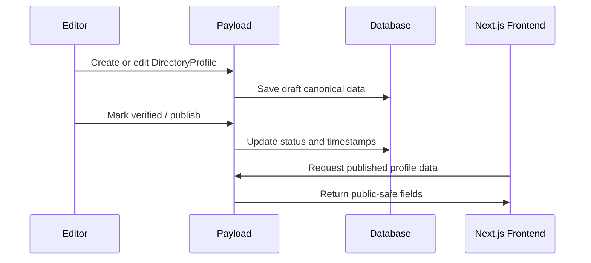
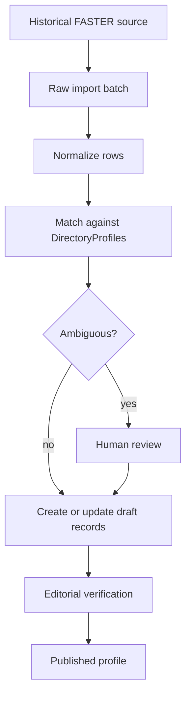
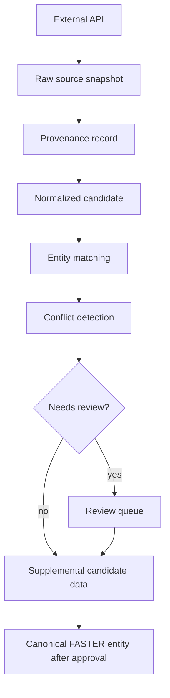
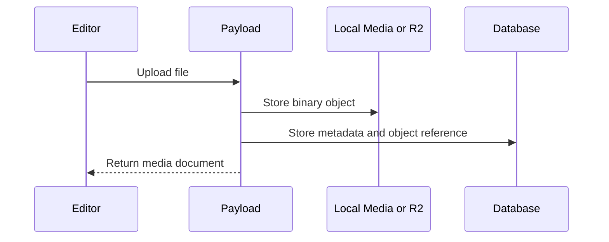
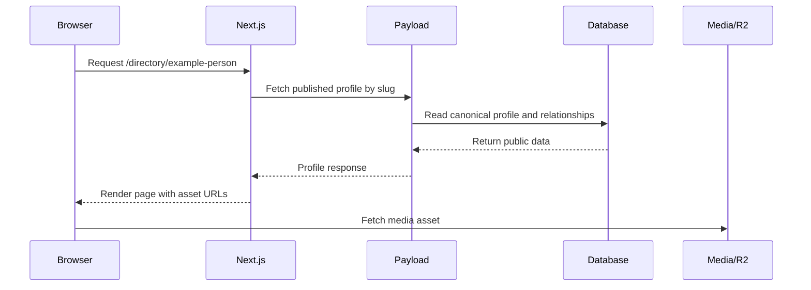

# Data Flow

## 1. Editor Creates Profile

```mermaid
sequenceDiagram
  participant Editor
  participant Payload
  participant DB as Database
  participant Frontend as Next.js Frontend

  Editor->>Payload: Create or edit DirectoryProfile
  Payload->>DB: Save draft canonical data
  Editor->>Payload: Mark verified / publish
  Payload->>DB: Update status and timestamps
  Frontend->>Payload: Request published profile data
  Payload->>Frontend: Return public-safe fields
```

## 2. Historical Speaker Import

```mermaid
flowchart TD
  A[Historical FASTER source] --> B[Raw import batch]
  B --> C[Normalize rows]
  C --> D[Match against DirectoryProfiles]
  D --> E{Ambiguous?}
  E -- yes --> F[Human review]
  E -- no --> G[Create or update draft records]
  F --> G
  G --> H[Editorial verification]
  H --> I[Published profile]
```

## 3. Public API Import

```mermaid
flowchart TD
  A[External API] --> B[Raw source snapshot]
  B --> C[Provenance record]
  C --> D[Normalized candidate]
  D --> E[Entity matching]
  E --> F[Conflict detection]
  F --> G{Needs review?}
  G -- yes --> H[Review queue]
  G -- no --> I[Supplemental candidate data]
  H --> I
  I --> J[Canonical FASTER entity after approval]
```

## 4. Asset Upload

```mermaid
sequenceDiagram
  participant Editor
  participant Payload
  participant Storage as Local Media or R2
  participant DB as Database

  Editor->>Payload: Upload file
  Payload->>Storage: Store binary object
  Payload->>DB: Store metadata and object reference
  Payload-->>Editor: Return media document
```

## 5. Frontend Profile Request

```mermaid
sequenceDiagram
  participant Browser
  participant Next as Next.js
  participant Payload
  participant DB as Database
  participant Storage as Media/R2

  Browser->>Next: Request /directory/example-person
  Next->>Payload: Fetch published profile by slug
  Payload->>DB: Read canonical profile and relationships
  DB-->>Payload: Return public data
  Payload-->>Next: Profile response
  Next-->>Browser: Render page with asset URLs
  Browser->>Storage: Fetch media asset
```

