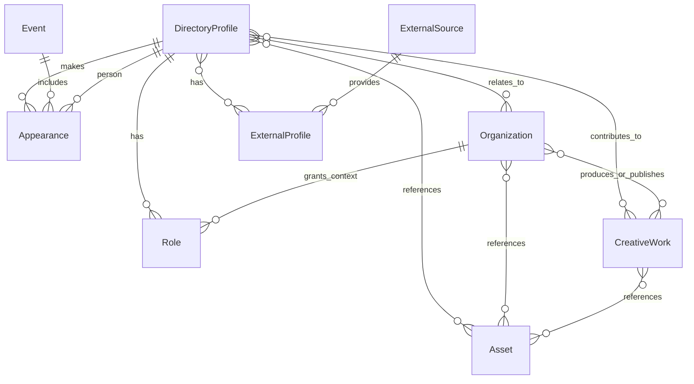

# Entity Relationships

The directory should use a normalized model. People, organizations, events, appearances, creative works, assets, and external identities are separate concepts.

## Mermaid ER Diagram

## Relationship Rules

- `DirectoryProfile` is the canonical person.
- `Organization` covers businesses, nonprofits, employers, collectives, sponsors, and FASTER itself.
- `Event` represents FASTERCON or other events.
- `Appearance` joins a person to an event with a role, session, year, and evidence.
- `CreativeWork` represents films, books, music, videos, projects, and other works.
- `Asset` stores object references and metadata, not binary payloads.

## Examples

### One Person With Many Roles

One `DirectoryProfile` may have roles for FASTER speaker, filmmaker, founder, board member, and content creator. These roles should be rows/embedded relationship objects, not separate person records.

### Multiple People Attached To One Business

One `Organization` can have multiple related `DirectoryProfile` records:

- Founder
- Co-owner
- Employee
- Advisor
- Board member

### One Speaker At Multiple FASTER Events

One `DirectoryProfile` can have many `Appearance` records:

- FASTERCON 2018 speaker
- FASTERCON 2021 panelist
- Workshop mentor

### One Film With Multiple Creatives

One `CreativeWork` can connect to multiple people:

- Director
- Writer
- Producer
- Composer
- Actor
- Animator

