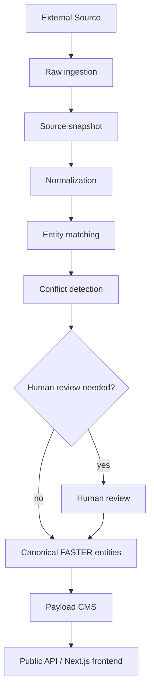

# API Ingestion

This is a conceptual ETL/data pipeline. No production ingestion logic is implemented by this document.

## Pipeline

## Rules

- Separate raw imported payloads from canonical data.
- Never transform third-party data in place without retaining sufficient source metadata for auditing.
- Store provider, source URL, external ID, retrieval timestamp, license, and attribution requirements.
- Do not publish imported data until it is approved.
- Do not overwrite verified FASTER data with automated imports.

## Import Job States

Suggested states:

- `queued`
- `running`
- `normalized`
- `needs_review`
- `partially_imported`
- `completed`
- `failed`

## Conflict Handling

Conflicts should create reviewable records showing:

- Existing canonical value.
- Imported candidate value.
- Source priority.
- Retrieval time.
- Suggested action.
- Human decision and timestamp.

